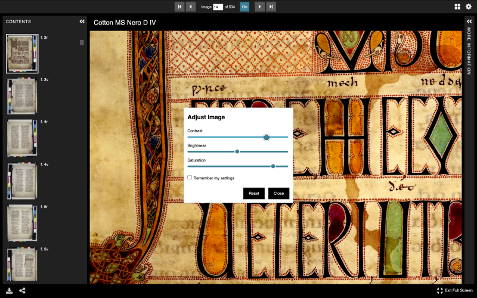

We're excited to announce the release of [Universal Viewer](https://universalviewer.io/) (UV) version 4.1.0, packed with new updates and features.

*New image manipulation controls in UV 4.1.0*

This version builds on the momentum from our [community accessibility sprint](https://blogs.bl.uk/digital-scholarship/2024/11/working-together-the-community-sprint-experience-.html), where the wider UV community came together to address key usability challenges. Highlights of the new release include:

Accessibility Improvements:

- Easier navigation for keyboard-only users.
- Better support for assistive technologies such as screen readers.
- Improved contrast and visibility of page elements.

New Features:

- Image Controls: Adjust brightness, contrast, and saturation directly within the viewer.
- Index Panel Configuration: A new setting allows the index panel to open by default when viewing collections.

Bug Fixes & Security Updates:

- Several bugs resolved to enhance stability and performance.
- Dependency updates to ensure the Universal Viewer remains secure and up to date.

For the full details of what's new, check out the [release notes](https://github.com/UniversalViewer/universalviewer/releases/tag/v4.1.0) on GitHub.

Interested in joining the Universal Viewer community? To get involved join us on [Slack](https://docs.google.com/forms/d/e/1FAIpQLSeHLD0kng5aXvGFsNN_tJGsZMTnp08Hv2F6kdGsJRb6bT0NWw/viewform), or follow UV on [Bluesky](https://bsky.app/profile/universalviewer.io) or [Mastodon](https://glammr.us/@universalviewer) to stay connected.
